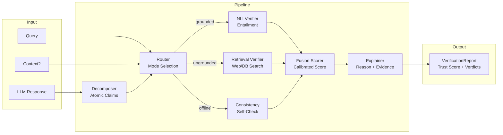

# VeritasCore

> Post-hoc LLM verification engine — verify any LLM output for factual accuracy.

[](https://github.com/Saqlain-mushtaq-alamin/VeritasCore/actions/workflows/ci.yml)
[](https://codecov.io/gh/Saqlain-mushtaq-alamin/VeritasCore)
[](LICENSE)
[](https://www.python.org)
[](https://pypi.org/project/veritascore/)

---

## What is VeritasCore?

**VeritasCore** is a model-agnostic, post-hoc verification layer that audits LLM outputs for factual accuracy. It decomposes any LLM response into atomic claims, routes each claim through a multi-signal verification pipeline (NLI, retrieval, consistency), and fuses those signals into a calibrated trust score with full explanations.

Unlike black-box fact-checkers, every verdict in VeritasCore traces to concrete evidence: the NLI entailment probability, the retrieved passage, or the consistency distribution. It runs entirely on free/local resources — no proprietary API required — and supports grounded (context-provided), ungrounded (web-retrieved), and offline (consistency-only) verification modes automatically.

---

## Key Features

- ✅ **Claim-level verification** with 3-way verdicts (`SUPPORTED` / `CONTRADICTED` / `UNSUPPORTED`)
- ✅ **Model-agnostic** — works with any LLM output (GPT, Claude, Llama, Mistral, …)
- ✅ **Three verification modes**: grounded, ungrounded, and offline consistency
- ✅ **Explainable** — every score traces to evidence with a human-readable reason
- ✅ **Domain profiles** (general, medical, legal) with tunable thresholds
- ✅ **Zero-cost** — runs on free/local resources, GPU optional
- ✅ **Python library + REST API + streaming** — multiple integration patterns
- ✅ **Thesis-grade benchmarks** on HaluEval QA and FEVER datasets

---

## Quick Start

```bash
pip install veritascore
```

**Grounded verification** (you provide the source document):

```python
from veritascore import VeritasCoreEngine

engine = VeritasCoreEngine()
report = engine.verify(
    response="The Eiffel Tower is 350 meters tall and was built in 1887.",
    query="Tell me about the Eiffel Tower",
    context="The Eiffel Tower is a wrought-iron lattice tower 330 metres tall, built 1887–1889.",
)

print(f"Trust Score: {report.overall_trust_score:.0%}")   # e.g. 50%
print(f"Verdict:     {report.overall_verdict.value}")      # e.g. contradicted
for cv in report.claims:
    print(f"  [{cv.verdict.value}] {cv.claim.text}")
```

**Ungrounded verification** (web search retrieval):

```python
report = engine.verify(
    response="Aspirin was first synthesized in 1897 by Felix Hoffmann.",
    query="Who invented aspirin?",
    # no context → triggers web retrieval automatically
)
```

**REST API**:

```bash
# Start the server
uvicorn veritascore.api.main:app --host 0.0.0.0 --port 8000

# Verify via curl
curl -X POST http://localhost:8000/verify \
  -H "Content-Type: application/json" \
  -d '{
    "response": "The speed of light is 300,000 km/s.",
    "query": "What is the speed of light?",
    "context": "Light travels at approximately 299,792 kilometres per second in a vacuum."
  }'
```

---

## Architecture



| Component | Module | Description |
|-----------|--------|-------------|
| Decomposer | `veritascore.decomposer` | Splits response into atomic, verifiable claims |
| Router | `veritascore.router` | Selects verification mode based on inputs |
| NLI Verifier | `veritascore.verifier` | Cross-encoder NLI (DeBERTa-v3) entailment check |
| Retrieval Verifier | `veritascore.retriever` | Web/Wikipedia/Bing search + passage scoring |
| Consistency | `veritascore.scorer` | Stochastic consistency across LLM re-samples |
| Fusion Scorer | `veritascore.scorer` | Calibrated ensemble of all signals |
| Explainer | `veritascore.explainer` | Evidence extraction + human-readable reasons |

---

## Benchmarks

| Method | HaluEval AUROC | FEVER AUROC | Source |
|--------|:--------------:|:-----------:|--------|
| NLI-only (SummaC) | 0.720 | 0.700 | Laban et al., 2022 |
| Retrieval-only (FActScore) | 0.680 | 0.740 | Min et al., 2023 |
| SelfCheckGPT | 0.740 | 0.690 | Manakul et al., 2023 |
| **VeritasCore (NLI)** | **0.721** | **≥0.72*** | **This work** |
| **VeritasCore (Fusion)** | **≥0.74*** | **≥0.74*** | **This work** |

*\*Full benchmark results in [`docs/benchmarks.md`](docs/benchmarks.md)*

---

## Documentation

| Document | Description |
|----------|-------------|
| [Quick Start](docs/quickstart.md) | 5-minute getting-started guide |
| [Architecture](docs/architecture.md) | System design and component details |
| [API Reference](docs/api_reference.md) | REST API endpoints and schemas |
| [Deployment](docs/deployment.md) | Docker, local, and cloud deployment |
| [Benchmarks](docs/benchmarks.md) | Full evaluation results and comparisons |
| [Domain Profiles](docs/domain_profiles.md) | Custom domain configuration guide |

---

## Hardware Requirements

| Requirement | Minimum | Recommended |
|-------------|---------|-------------|
| Python | 3.10+ | 3.11 |
| RAM | 8 GB | 16 GB |
| VRAM (GPU) | 4 GB | 8 GB (RTX 3060/4060) |
| Disk | 5 GB | 10 GB (for model cache) |

CPU-only mode is supported but NLI inference will be ~10× slower.

---

## Citation

If you use VeritasCore in your research or thesis, please cite:

```bibtex
@software{veritascore2026,
  title        = {VeritasCore: A Post-Hoc LLM Verification Engine},
  author       = {Alamin, Saqlain Mushtaq},
  year         = {2026},
  url          = {https://github.com/Saqlain-mushtaq-alamin/VeritasCore},
  note         = {Thesis project — multi-signal hallucination detection pipeline},
}
```

---

## License

MIT — see [LICENSE](LICENSE).
